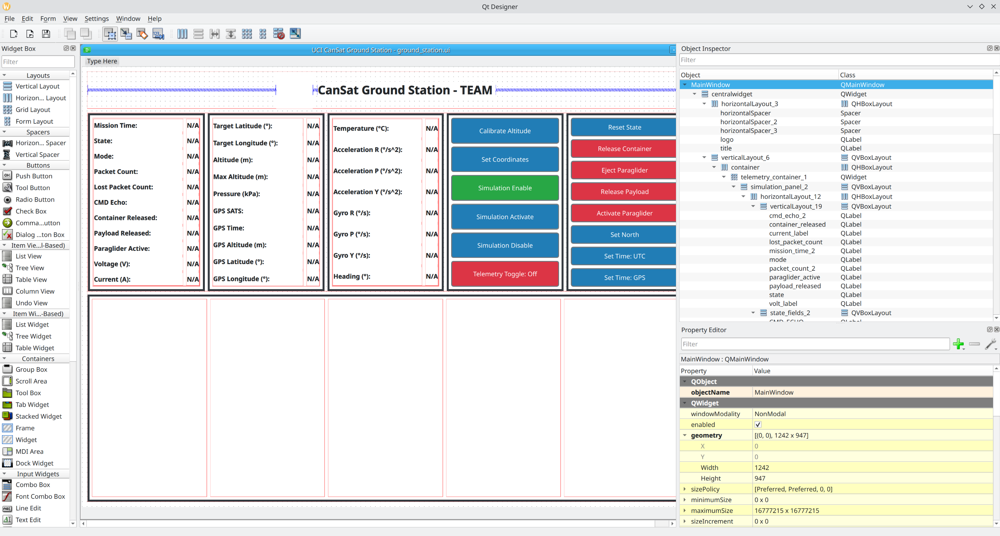

# UCI CanSat 2026 - 2027 Ground-Station #

## Requirements and Reccomendations ##   
I would reccomend a local conda enviroment to install the required modules such as pyserial, pyqt5, ... 

Run the laptop ground station with: 
``` bash
python ground-station.py
```  

You have to edit the .ui file using pyqt designer. 
The GUI is loaded from the .ui file in ground-station.py  


Example run of what I do to edit the .ui file:  
``` bash
(base)  jonathan@panda:~/Documents/CanSat-67 (main)$ conda activate CanSatGS
(CanSatGS)  jonathan@panda:~/Documents/CanSat-67 (main)$ pyqt5-tools designer
```  
Press open file and click on the ground_station.ui file and the GUI should pop up:  


